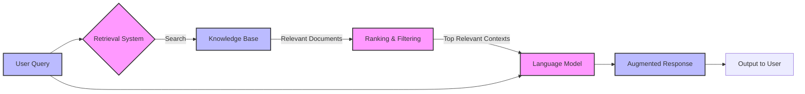

# RAG

```
Can you give me a short and simple summary what RAG is?
```

RAG is an AI technique that combines two key steps to improve the accuracy and relevance of AI-generated responses:

1. **Retrieval**: When a user asks a question, the system first searches through a large database of documents or knowledge sources to find the most relevant information.
2. **Generation**: The AI then uses these retrieved, contextually relevant documents as additional context when formulating its response, allowing it to provide more accurate, up-to-date, and sourced information.

Think of RAG like a researcher who:

* Looks through a library of books and articles
* Finds the most relevant sources
* Uses those sources to craft a well-informed answer




### User Query

The user query (or Prompt) is what the user asks the AI.

### Retrieval System

A Retrieval System is an intelligent search mechanism that:

* Quickly scans through large collections of documents, databases, or knowledge bases
* Uses advanced search algorithms to find the most relevant information
* Matches user queries against indexed content
* Ranks and filters retrieved documents based on their relevance
* Supports AI in finding precise, contextually appropriate information

Key characteristics:

* Uses techniques like semantic search, vector embeddings, and machine learning
* Can understand context and meaning, not just keyword matching
* Efficiently narrows down vast amounts of information to the most pertinent sources
* Enables AI to ground responses in real, up-to-date information

### Knowledge Base

A knowledge Base (often a Vector Database) is a structured collection of information that serves as the foundational data source for a retrieval system. It typically includes:

* Diverse documents, articles, research papers, and data sources
* Organized and indexed for efficient searching
* Can cover specific domains (e.g., medical research, technical documentation)
* Continuously updated to maintain relevance
* Stored in formats like databases, document repositories, or vector databases

Key characteristics:

* Contains structured and unstructured information
* Enables semantic search and context-aware retrieval
* Provides rich, authoritative context for AI-generated responses
* Can be domain-specific or broad-ranging
* Supports accurate and up-to-date information retrieval

### Ranking & Filtering


### Language Model


### Augmented Response
