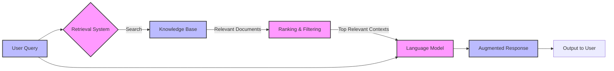

# RAG

```
Can you give me a short and simple summary what RAG is?
```

RAG is an AI technique that combines two key steps to improve the accuracy and relevance of AI-generated responses:

1. **Retrieval**: When a user asks a question, the system first searches through a large database of documents or knowledge sources to find the most relevant information.
2. **Generation**: The AI then uses these retrieved, contextually relevant documents as additional context when formulating its response, allowing it to provide more accurate, up-to-date, and sourced information.

Think of RAG like a researcher who:

* Looks through a library of books and articles
* Finds the most relevant sources
* Uses those sources to craft a well-informed answer




